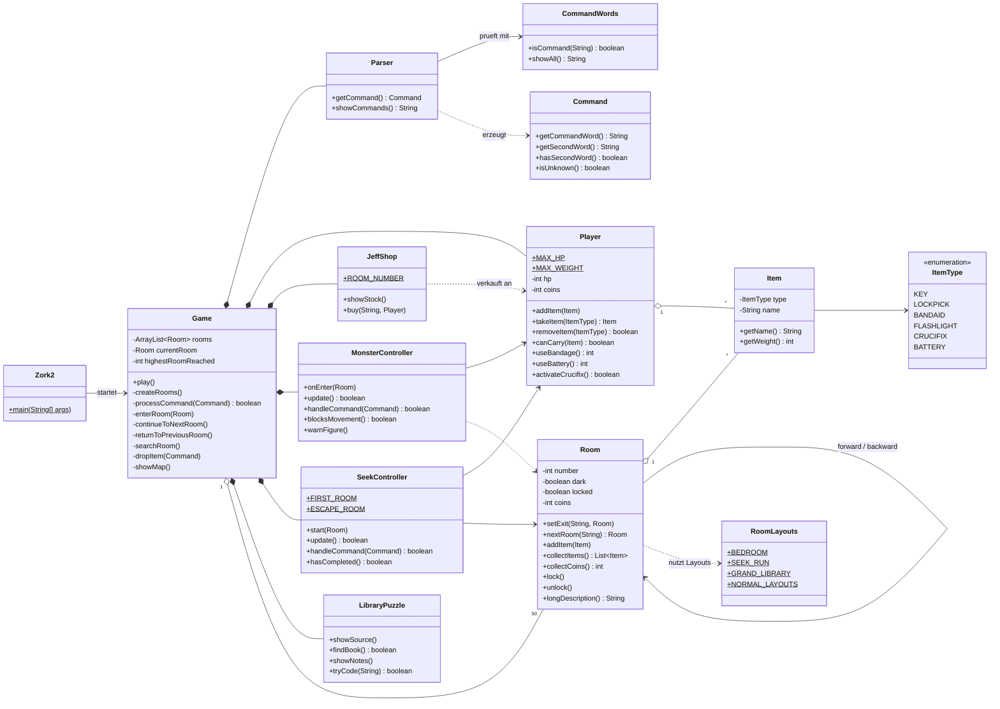

# DOORS: Terminal Edition - Klassendiagramm

Stand: aktueller Branch `improvements` (inkl. `back`, `map`, `drop` und Gewichtslimit).

```mermaid
classDiagram
    direction LR

    class Zork2 {
        +main(String[] args)$
    }

    class Game {
        -ArrayList~Room~ rooms
        -Room currentRoom
        -int highestRoomReached
        +play()
        -createRooms()
        -processCommand(Command) boolean
        -enterRoom(Room)
        -continueToNextRoom()
        -returnToPreviousRoom()
        -searchRoom()
        -dropItem(Command)
        -showMap()
    }

    class Parser {
        +getCommand() Command
        +showCommands() String
    }

    class CommandWords {
        +isCommand(String) boolean
        +showAll() String
    }

    class Command {
        +getCommandWord() String
        +getSecondWord() String
        +hasSecondWord() boolean
        +isUnknown() boolean
    }

    class Room {
        -int number
        -boolean dark
        -boolean locked
        -int coins
        +setExit(String, Room)
        +nextRoom(String) Room
        +addItem(Item)
        +collectItems() List~Item~
        +collectCoins() int
        +lock()
        +unlock()
        +longDescription() String
    }

    class RoomLayouts {
        +BEDROOM$
        +SEEK_RUN$
        +GRAND_LIBRARY$
        +NORMAL_LAYOUTS$
    }

    class Player {
        +MAX_HP$
        +MAX_WEIGHT$
        -int hp
        -int coins
        +addItem(Item)
        +takeItem(ItemType) Item
        +removeItem(ItemType) boolean
        +canCarry(Item) boolean
        +useBandage() int
        +useBattery() int
        +activateCrucifix() boolean
    }

    class Item {
        -ItemType type
        -String name
        +getName() String
        +getWeight() int
    }

    class ItemType {
        <<enumeration>>
        KEY
        LOCKPICK
        BANDAID
        FLASHLIGHT
        CRUCIFIX
        BATTERY
    }

    class JeffShop {
        +ROOM_NUMBER$
        +showStock()
        +buy(String, Player)
    }

    class MonsterController {
        +onEnter(Room)
        +update() boolean
        +handleCommand(Command) boolean
        +blocksMovement() boolean
        +warnFigure()
    }

    class SeekController {
        +FIRST_ROOM$
        +ESCAPE_ROOM$
        +start(Room)
        +update() boolean
        +handleCommand(Command) boolean
        +hasCompleted() boolean
    }

    class LibraryPuzzle {
        +showSource()
        +findBook() boolean
        +showNotes()
        +tryCode(String) boolean
    }

    Zork2 --> Game : startet
    Game *-- Parser
    Game *-- Player
    Game *-- JeffShop
    Game *-- MonsterController
    Game *-- SeekController
    Game *-- LibraryPuzzle
    Game "1" o-- "50" Room
    Parser --> CommandWords : prueft mit
    Parser ..> Command : erzeugt
    Room "1" o-- "*" Item
    Room --> Room : forward / backward
    Room ..> RoomLayouts : nutzt Layouts
    Player "1" o-- "*" Item
    Item --> ItemType
    JeffShop ..> Player : verkauft an
    MonsterController --> Player
    SeekController --> Player
    SeekController --> Room
    MonsterController ..> Room
```
