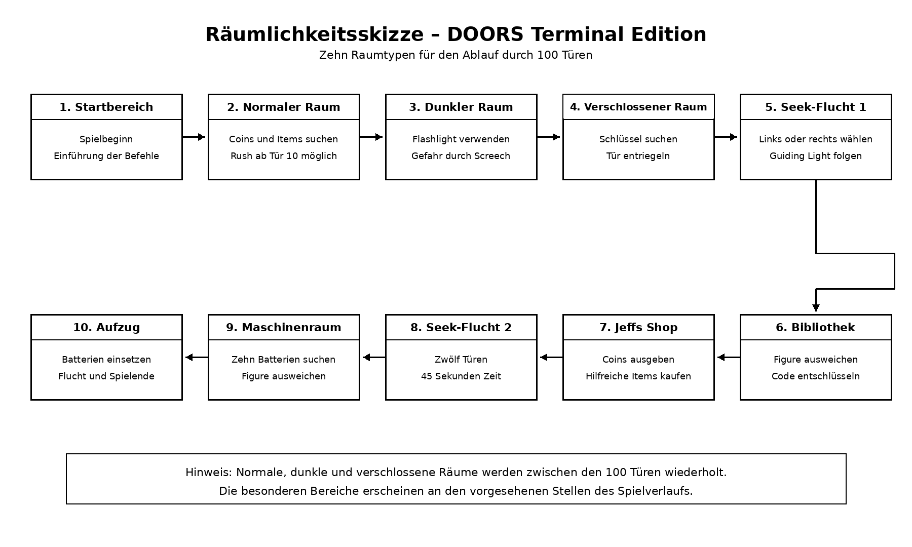

# Dokumentation der Räumlichkeiten

## 1. Übersicht

Das Spiel **DOORS: Terminal Edition** besteht aus insgesamt 100 Türen. Da viele Räume während des Spielverlaufs wiederholt oder leicht verändert vorkommen, zeigt die Skizze zehn grundlegende Raumtypen. Diese decken den vollständigen Ablauf vom Spielstart bis zur Flucht mit dem Aufzug ab.

Die Pfeile stellen die Reihenfolge dar, in welcher der Spieler die verschiedenen Bereiche erreicht. Normale, dunkle und verschlossene Räume können zwischen den besonderen Ereignissen mehrfach vorkommen.

## 2. Raumskizze

## 3. Beschreibung der Räume

### 3.1 Startbereich

Im Startbereich beginnt das Spiel. Der Spieler erhält eine kurze Einführung und lernt die grundlegenden Befehle kennen. Von hier aus betritt er den ersten normalen Raum.

### 3.2 Normaler Raum

Der normale Raum bildet den häufigsten Raumtyp. Der Spieler kann den Raum mit `search` nach Coins, Items oder Hinweisen durchsuchen. Ab Tür 10 besteht zusätzlich die Möglichkeit, dass Rush erscheint.

### 3.3 Dunkler Raum

In einem dunklen Raum ist die Orientierung eingeschränkt. Eine Flashlight erleichtert das Finden von Gegenständen und der nächsten Tür. Ohne Licht kann der Spieler die Tür übersehen. Ausserdem kann Screech erscheinen und dem Spieler bei einer zu langsamen Reaktion Schaden zufügen.

### 3.4 Verschlossener Raum

Die Ausgangstür dieses Raumes ist verriegelt. Der Spieler muss den Raum durchsuchen und den passenden Schlüssel finden, bevor er weitergehen kann. In einem dunklen, verschlossenen Raum ist die Suche zusätzlich erschwert.

### 3.5 Erste Seek-Flucht

Bei Tür 35 beginnt die erste Verfolgung durch Seek. In jedem Abschnitt muss der Spieler zwischen einer linken und einer rechten Tür wählen. Das Guiding Light markiert mit einem Stern die richtige Richtung. Der Spieler muss Tür 46 innerhalb von 45 Sekunden erreichen.

### 3.6 Bibliothek

Die Bibliothek befindet sich bei Tür 50 und wird von Figure bewacht. Der Spieler sucht Bücher, ordnet Symbole den passenden Zahlen zu und ermittelt daraus einen fünfstelligen Code. Da Figure sehr gut hört, kann jede Suche seine Aufmerksamkeit auslösen.

### 3.7 Jeffs Shop

Nach der Bibliothek erreicht der Spieler Jeffs Shop. Dort können gesammelte Coins für hilfreiche Items ausgegeben werden. Angeboten werden beispielsweise Bandaids, eine Flashlight und ein Crucifix.

### 3.8 Zweite Seek-Flucht

Ab Tür 75 erscheint Seek erneut. Die zweite Verfolgung funktioniert nach demselben Prinzip wie die erste, ist mit zwölf Türen jedoch länger. Der Spieler hat erneut 45 Sekunden Zeit. Eine falsche Richtung kostet fünf Sekunden.

### 3.9 Maschinenraum

Der Maschinenraum stellt den letzten grossen Spielbereich bei Tür 100 dar. Er besteht aus den Bereichen West, Ost, Nord, Süd und Aufzug. Der Spieler muss insgesamt zehn Batterien finden, während Figure den Bereich bewacht. Bei jeder Suche besteht die Gefahr, dass Figure den Spieler hört.

### 3.10 Aufzug

Der Aufzug ist das Ziel des Spiels. Sobald der Spieler alle zehn Batterien gefunden hat, kann er sie einsetzen und den Aufzug aktivieren. Dadurch entkommt er dem Gebäude und gewinnt das Spiel.

## 4. Wiederverwendung der Raumtypen

Die Skizze zeigt keine 100 einzelnen Räume. Stattdessen werden normale, dunkle und verschlossene Räume während des Spielverlaufs wiederholt eingesetzt. Dadurch können die 100 Türen abwechslungsreich aufgebaut werden, ohne für jede Tür eine vollständig neue Raumklasse zu benötigen.

Die Seek-Fluchten, die Bibliothek, Jeffs Shop, der Maschinenraum und der Aufzug sind besondere Bereiche. Sie erscheinen nur an festgelegten Stellen und verändern den normalen Spielablauf.

## 5. Zweck der Darstellung

Die Darstellung dient als grobe Übersicht der Spielwelt. Sie zeigt, welche Raumtypen benötigt werden, welche Aufgabe sie besitzen und wie der Spieler vom Start bis zum Ende gelangt. Die genauen Klassen und Beziehungen der technischen Umsetzung werden separat im UML-Klassendiagramm dargestellt.
